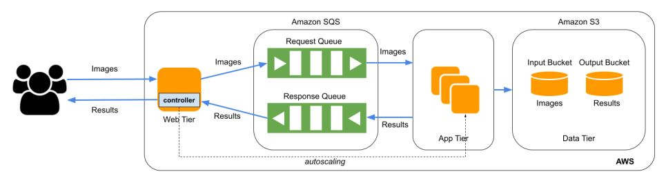

## Overview 
In the first part, I developed an elastic application that automatically scales in and scales out to perform image classification using a deep learning model. Horizontal scaling is one of the most fundamental concepts of distributed computing. I used Infrastructure as a Service (IaaS) resources provided by Amazon Web Services (AWS) resources to develop the cloud application which provides Horizontal scalability, persistent storage for the results, and APIs for clients to access the app.    

### Architecture 
This image recognition autoscaling project consists of two major components - namely web-tier and app-tier. As evident from the architecture diagram attached below, the interaction with the application (referring to the whole project as “application” to avoid confusion with app-tier) is exposed to the public domain via web-tier. I implemented the web-tier server in Node.js using Express framework. The web-tier server exposes a POST API which takes an image as input and expects the image label as the output in plain text format.   

As soon as the web-tier API controller receives any request, it pushes the request image in a Request SQS Queue. This is a FIFO queue used to ensure that no requests are missed in the process of autoscaling. The image is pushed in the input queue with the image name (eg. image_51.jpg) as the key and the image as the value for the corresponding key. Once the image is placed into the input queue, then the app tier autoscaling comes into play.

The controller process running in the web-tier repeatedly keeps polling the input SQS queue using short-polling strategy to check if there are any request images in the input queue to be processed. If some messages are retrieved from the queue - the controller process checks if we have any running instances to serve this request image, if not new instances are spawned as per the autoscaling logic mentioned in the following section. The number of instances spawned depends on the number of messages in the input queue. Initially, there are no app-tier instances running but the autoscaling scenario comes into action as soon as there is one message in the input queue.  

The app-tier instance snapshot is created using the image classification AMI given. The given AMI doesn’t expose any endpoint which would be needed for accessing the image classifier, from web-tier which is hosted on an entirely separate ec2 instance. So I needed to create a new snapshot that wraps the given API inside a new flask-enabled controller, effectively exposing it to the public domain. This snapshot is used for spawning new app-tier instances whenever required by the autoscaling logic.

Once the above-mentioned web-tier controller process reads the required number of app-tier instances being running, the images waiting in the input queue are picked and sent as request to one of the app-tier services. The app-tier service dumps the request image in the Input S3 bucket corresponding to the image name that is used as key. The embedded image labeling model is then used to get the image classification label that is dumped into the Output S3 bucket with image name as key and image label as the content in the value file. The service also puts the image recognition label/result as value and corresponding image name as key in the output SQS queue.

The output SQS queue is also a FIFO queue which is continuously polled from a separate process in the web-tier using long-polling strategy. This process keeps monitoring the output-queue and as soon as a message is received in the queue, the message is read, put to a global map, and deleted from the output queue. I used a global hashtable/map to efficiently poll for the results. If not hashmap, I would have been required to poll the output queue directly from each of the concurrent request threads waiting for their responses in the web-tier. That would be too inefficient and time/resource consuming because I will poll queue more frequently. Instead, the above-mentioned global map is repeatedly monitored by the individual concurrent requests waiting for the response. Once a waiting request thread finds an entry corresponding to its request image name in the map, that thread immediately reads the label, deleted it from the map, and returns the response to the original POST API request targeted for the web-tier server.   

This architecture enables the application to serve any amount of huge workload without missing any requests. If all the instances are currently occupied, the pending request will be stored in the input SQS queue for later processing.

### Running and testing
I deployed the source code in an EC2 instance and after setting up the required configuration (like exposing the instance's IPv4 address to public), the service/API will be avaialble on a unique URL. The correctness and efficiency of the implmentation was testing using workload generator file. 
