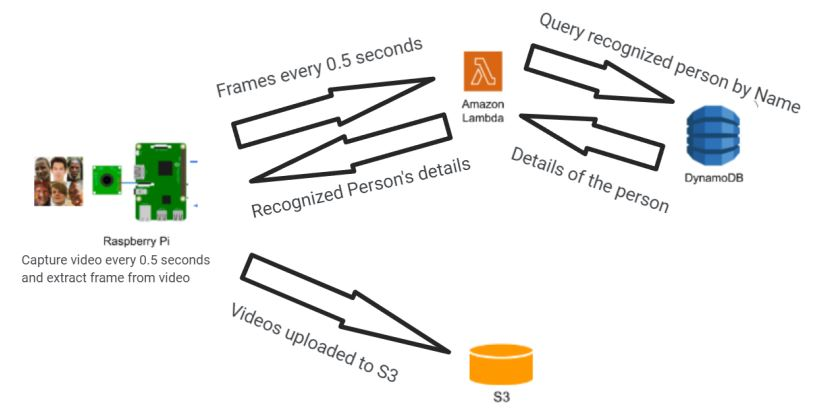

## Overview  
In the second part, I developed a distributed application that utilizes PaaS service (AWS Lambda) and IoT device (Raspberry Pi), to perform face recognition in real-time on the video feed received from the camera on the Raspberry Pi device. After facial recognition on lambda, I then fetch details about the person from a database (DynamoDB in my case). This project mimics real-world use cases like CCTV cameras with person identification features, and smart video doorbells like Ring, and Nest.      

### Architecture  
The RaspberryPI starts recording the video once the program hosted in Pi starts. It captures a video recording every 0.5 seconds and pass the saved video to a separate thread for further processing. This new thread extracts a frame from the recording, sends that frame as part of the request body to the Lamba API gateway, and saves the recording in the S3 bucket configured. I have a gateway that listens for incoming HTTP requests and triggers an event to my Lambda function. There is an option to specify the capture resolution in PiCamera. Since my model only needs a 160x160 image, I am only capturing videos of that resolution. My model also needs RGB images so I only capture RGB. The lambda function is deployed as a container that contains the custom-trained face-recognition model and the code to run the prediction and preprocessing.

  

I had two major options when it comes to deploying a function on AWS Lambda service. As part of the first alternative, I could simply write the required function code in the IDE provided by Lambda itself and add other required dependent files and dependencies manually or I could write similar code in a custom IDE offline and upload it. The second alternative is to deploy the required code and dependencies as part of a Docker container. Since I had many dependencies and required library imports - I choose to go with Docker container-based deployment on Lambda. This way I simply mentioned the dependencies in the DockerFile only once and that would take care of setting up the required execution environment during deployment. The Docker file is uploaded to the AWS ECR service which can be then used to deploy a new Lambda function. The Lambda function provided in the Docker image is invoked when a request is sent by Pi to the API gateway configured as a trigger. The fine-tuned custom face recognition model is also deployed as part of the same Docker image. The Lambda function simply takes the png image from the request forwarded by the trigger event, loads the Face recognition trained model, and performs the prediction on that image. Once I get a label name for the request image, I query DynamoDB with the predicted label name as a parameter and fetch the details for the corresponding student. The static read-only details for all the participant was added in a table in DynamoDB before itself. Thus fetched details are then returned to the Pi via the API gateway. For all of this configuration to run, I would need to explicitly grant DynamoDB read privilege to the Lambda function role. All other required privileges are automatically assigned to the default Lambda function role created during container image deployment.   

As part of processing, I needed to finetune the standard Face recognition model with the faces of selected random people. The first step for training the model was to prepare the training and validation data. I used Raspberry Pi to collect the face images in the format of ‘.png’. The collected images were made sure to be in diverse features like - different facial expressions, changing the angle of the camera, different lighting conditions, and different background conditions. I then made a subset of images with some images being used for training the model and some images (following 80-20 split) being used for getting the accuracy of my model. The collected images are stored at ‘data/real_images/’ with training images of each person being stored ‘data/real_images/training/firstName_lastName’ and validation images of each person being stored at ‘data/real_images/val/firstName_lastName’. To train the model I then used the train_face_recognition.py script. This saved the weight of the model which had the best validation accuracy in the ‘checkpoint/model_vggface2_best.pth’ file, and the labels were stored at ‘checkpoint/labels.json’. When it comes to prediction, the face recognition model tries to download the standard resnet trained model weight each time the container is deployed. To speed up this initial invocation, I cached this resnet weights file and used cached file in the prediction method. 
With all above mentioned components, I got a fully functional end-to-end distributed system which could capture real time feed from Pi and respond with the details of whom this person could most probably be.    


## Running and Testing 
###### To test the end to end flow, use following command on pi terminal: 
```python3 capture_videos.py```  

###### To create a Docker image from docker-image-folder use following commands: 
```docker build -t ccproj2 .```  

###### To tag the image as latest and push it to ECR, use following command with custom account identifiers: 
```docker tag ccproj2:latest 600083409750.dkr.ecr.us-east-1.amazonaws.com/ccproj2:latest``` 

```docker push 600083409750.dkr.ecr.us-east-1.amazonaws.com/ccproj2:latest```
